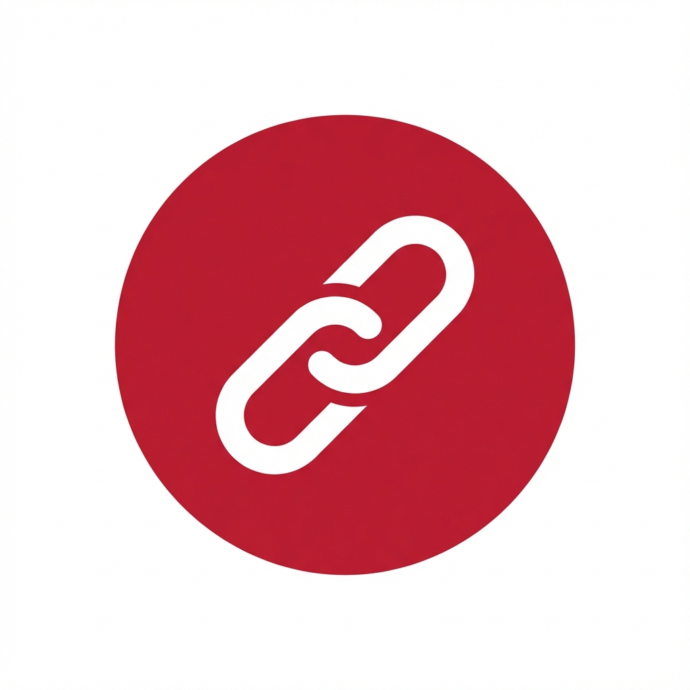

<p align="center">
  
</p>

<h1 align="center">🔗 LinkedIn Auto Connect</h1>

<p align="center">
  <strong>Kirim permintaan koneksi LinkedIn secara otomatis dengan cepat dan aman</strong>
</p>

<p align="center">
  <a href="#-fitur">Fitur</a> •
  <a href="#-instalasi">Instalasi</a> •
  <a href="#-cara-pakai">Cara Pakai</a> •
  <a href="#-screenshot">Screenshot</a> •
  <a href="#-faq">FAQ</a>
</p>

<p align="center">
  
  
  
  
  
</p>

---

## ✨ Fitur

| Fitur | Deskripsi |
|-------|-----------|
| 🚀 **Otomatis** | Kirim permintaan koneksi ke banyak profil sekaligus |
| 🛡️ **Aman** | Rate limiting & delay otomatis untuk menghindari deteksi |
| 📊 **Tracking** | Lihat riwayat hasil: sukses, gagal, dilewati |
| 💾 **Resume** | Lanjutkan sesi yang terputus |
| 🌍 **Multi-bahasa** | Support berbagai format URL LinkedIn |
| 📋 **Export** | Salin hasil ke clipboard dengan 1 klik |

---

## 📥 Instalasi

### Langkah 1: Download
```bash
git clone https://github.com/Sulthonikamalm/LinkedIn-Auto-Connect.git
```

Atau [Download ZIP](https://github.com/Sulthonikamalm/LinkedIn-Auto-Connect/archive/refs/heads/main.zip) dan extract.

### Langkah 2: Load Extension

<details>
<summary><strong>🌐 Google Chrome</strong></summary>

1. Buka `chrome://extensions/`
2. Aktifkan **Developer mode** (toggle di kanan atas)
3. Klik **Load unpacked**
4. Pilih folder extension yang sudah di-download
5. ✅ Selesai!

</details>

<details>
<summary><strong>🔷 Microsoft Edge</strong></summary>

1. Buka `edge://extensions/`
2. Aktifkan **Developer mode** (toggle di kiri bawah)
3. Klik **Load unpacked**
4. Pilih folder extension yang sudah di-download
5. ✅ Selesai!

</details>

---

## 🎯 Cara Pakai

### 1️⃣ Buka Extension
Klik icon extension di toolbar browser

### 2️⃣ Paste URL
```
https://www.linkedin.com/in/username1
https://www.linkedin.com/in/username2
linkedin.com/in/username3
```

> 💡 **Tips:** Bisa paste langsung dari Excel, Google Sheets, atau teks biasa!

### 3️⃣ Klik Jalankan
Extension akan otomatis:
- ✅ Membuka profil satu per satu
- ✅ Mengklik tombol Connect
- ✅ Mengirim tanpa catatan
- ✅ Menutup tab dan lanjut ke berikutnya

### 4️⃣ Lihat Hasil
Klik tab **Riwayat** untuk melihat:
- ✓ Profil yang berhasil terkirim
- ⊘ Profil yang dilewati (sudah connected/pending)
- ✗ Profil yang gagal

---

## 📸 Screenshot

<details>
<summary><strong>Lihat Screenshot</strong></summary>

### Tampilan Utama
- Input URL dengan validasi otomatis
- Stats realtime (Sisa, Sukses, Rasio)
- Progress bar dengan detail aksi

### Tab Riwayat
- Filter berdasarkan status
- Export hasil ke clipboard
- Hapus riwayat

</details>

---

## 📋 Format URL yang Didukung

Extension ini cerdas dalam mengenali URL! Berikut format yang **BISA** dipakai:

```
✅ https://www.linkedin.com/in/username
✅ https://linkedin.com/in/username
✅ www.linkedin.com/in/username
✅ linkedin.com/in/username
✅ 1) https://www.linkedin.com/in/username
✅ • www.linkedin.com/in/username
✅ https://www.linkedin.com/in/username?utm_source=share
```

---

## ⚙️ Konfigurasi

| Setting | Nilai | Keterangan |
|---------|-------|------------|
| Delay antar profil | 1-2.5 detik | Jeda sebelum buka profil berikutnya |
| Timeout loading | 25 detik | Maksimal waktu tunggu halaman load |
| Max per sesi | 100 profil | Batas untuk keamanan akun |
| Rate limit | 100/jam | Mencegah spam |

---

## ❓ FAQ

<details>
<summary><strong>Kenapa banyak yang TIMEOUT?</strong></summary>

Timeout berarti halaman LinkedIn loading terlalu lama. Penyebab:
- Koneksi internet lambat
- LinkedIn sedang sibuk
- Profil tidak valid

**Solusi:** Coba lagi dengan koneksi lebih cepat.

</details>

<details>
<summary><strong>Kenapa status PENDING?</strong></summary>

PENDING berarti Anda **sudah pernah** mengirim permintaan koneksi ke profil tersebut dan menunggu diterima.

</details>

<details>
<summary><strong>Kenapa NO_BUTTON?</strong></summary>

NO_BUTTON berarti profil tersebut **tidak punya tombol Connect**. Kemungkinan:
- Hanya bisa Follow (bukan Connect)
- Profil terbatas untuk koneksi
- Profil sudah mencapai batas koneksi

</details>

<details>
<summary><strong>Apakah aman untuk akun LinkedIn?</strong></summary>

Extension ini dirancang dengan fitur keamanan:
- Rate limiting otomatis
- Delay acak seperti manusia
- Tidak mengirim pesan spam

**Tapi tetap gunakan dengan bijak.** Jangan kirim terlalu banyak dalam waktu singkat.

</details>

<details>
<summary><strong>Bagaimana cara melanjutkan sesi yang terputus?</strong></summary>

Jika extension ditutup saat proses berjalan:
1. Buka extension lagi
2. Akan muncul banner "Sesi sebelumnya"
3. Klik **Lanjutkan** untuk melanjutkan dari posisi terakhir

</details>

---

## 🛠️ Struktur File

```
LinkedIn-Auto-Connect/
├── 📄 manifest.json      # Konfigurasi extension
├── 📄 popup.html         # Tampilan popup
├── 📄 popup.js           # Logika popup
├── 📄 styles.css         # Styling
├── 📄 background.js      # Service worker
├── 📄 content.js         # Script untuk LinkedIn
├── 📄 utils.js           # Utility classes
├── 📄 config.js          # Konfigurasi
├── 📄 README.md          # Dokumentasi
└── 📁 icons/             # Icon extension
    ├── icon16.png
    ├── icon32.png
    ├── icon48.png
    └── icon128.png
```

---

## 🔒 Keamanan & Privasi

- ✅ **Tidak menyimpan password** - Extension tidak mengakses kredensial
- ✅ **Data lokal** - Semua data disimpan di browser lokal
- ✅ **Tidak mengirim data** - Tidak ada server eksternal
- ✅ **Open source** - Kode bisa diperiksa

---

## 📝 Changelog

### v2.0.0 (2026-01-03)
- ✨ UI baru dengan tab Riwayat
- 🚀 Kecepatan lebih tinggi
- 🐛 Fix duplikat URL
- 🐛 Fix timeout error
- 📊 Stats realtime
- 💾 Export hasil

### v1.0.0
- 🎉 Rilis awal

---

## ⚠️ Disclaimer

> Penggunaan extension ini adalah **tanggung jawab pengguna**. Pastikan untuk:
> - Tidak spam koneksi berlebihan
> - Mengikuti [LinkedIn User Agreement](https://www.linkedin.com/legal/user-agreement)
> - Menggunakan untuk networking yang genuine

---

## 👨‍💻 Author

**dibuat oleh smalm**

---

## 📄 License

MIT License - Bebas digunakan dan dimodifikasi.

---

<p align="center">
  <strong>⭐ Jika berguna, berikan star di repository ini! ⭐</strong>
</p>
